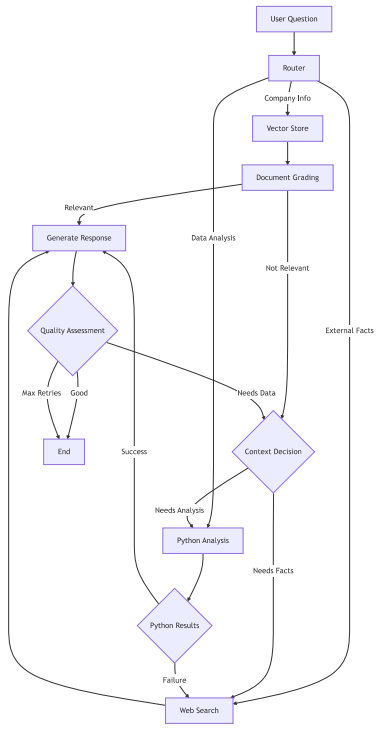

# Clay

## Description: My attempt at building a multi-modal internal assistant using Local LLM LLama 3.2 Vision. The project uses data for a hypothetical consulting company. 
## The data for the company was generated with ChatGPT. To answer each query the assistant goes through the following workflow.  
## 

## Demo
![demo.gif]
