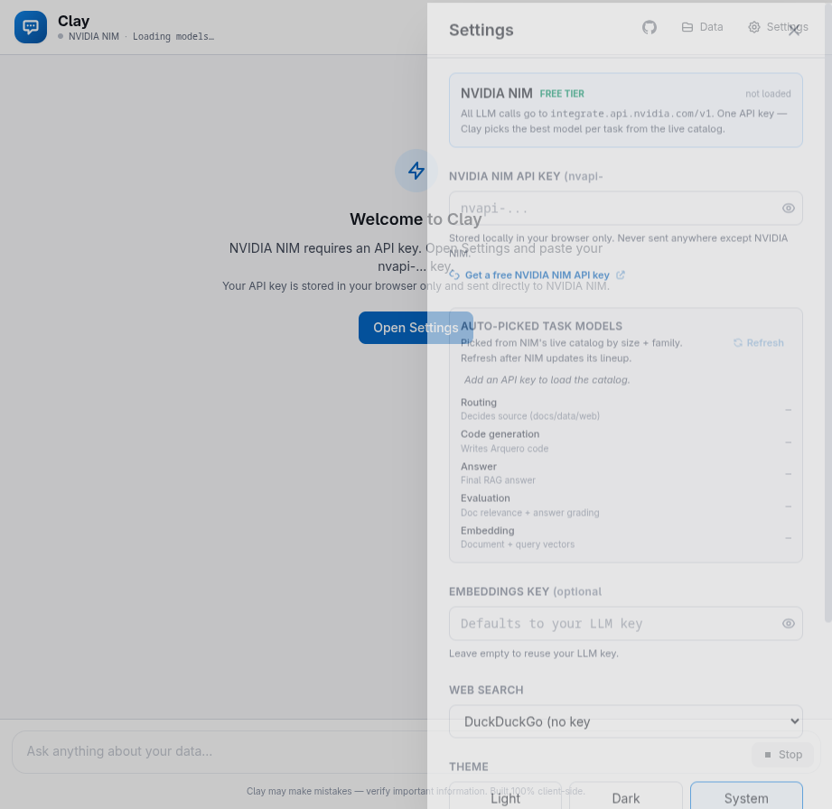

# Clay — RAG Assistant

> A browser-based Retrieval-Augmented Generation assistant. Drop your own CSVs, PDFs, or text files and query them with natural language.

[](https://opensource.org/licenses/MIT)
[](https://www.typescriptlang.org/)
[](https://react.dev/)
[](https://vitejs.dev/)
[](https://tailwindcss.com/)
[](https://github.com/3bdrahman/clay/actions)
[](https://3bdrahman.github.io/clay/)



Clay combines three retrieval paths behind a single chat surface:

- **Vector search** over uploaded documents (PDFs, markdown, text)
- **Data analysis** over uploaded CSV datasets via Arquero (pandas-like, in-browser)
- **Web search** for current facts and general knowledge

The orchestrator routes each question to the right source, runs an LLM-as-judge self-correction loop, and renders the entire pipeline in real time.

All processing runs in the browser. Bring your own key (BYOK) for **OpenRouter**, **Groq**, or **Together**, or point Clay at a **local OpenAI-compatible server** (Ollama, LM Studio, vLLM, llama.cpp). Switch in Settings. Web search is optional and also runs client-side via DuckDuckGo or Serper API.

---

## Live Demo

**Try it now:** [https://3bdrahman.github.io/clay/](https://3bdrahman.github.io/clay/)

Add your own API key in **Settings** — OpenRouter ([openrouter.ai/settings/keys](https://openrouter.ai/settings/keys)), Groq ([console.groq.com/keys](https://console.groq.com/keys)), or Together ([api.together.ai/settings/api-keys](https://api.together.ai/settings/api-keys)) — or configure a local OpenAI-compatible server (Ollama, LM Studio, vLLM, llama.cpp) to use the full AI capabilities.

---

## What this project demonstrates

- **Production-tier RAG architecture** — route → retrieve → grade → generate → evaluate, with retries
- **Multi-source synthesis** — documents, structured data, and the open web in one answer
- **Live workflow visualization** — every step (with timing) is shown as it runs
- **Self-correcting quality loop** — LLM-as-judge hallucination check + answer-usefulness grading
- **Single-model architecture** — one user-chosen chat model drives every LLM step (explicit cost control); the embedding model is auto-picked from the live catalog via externalized pattern rules
- **Agentic analysis tools** — the model inspects your actual data (column profiles, distributions, correlations, sample rows) through function-calling tools, then delivers structured insights with evidence and a confidence level
- **Bring-your-own-data** — no forced scenario; drop any CSV/PDF/MD/TXT/JSON and start querying
- **Runs entirely in your browser** — no backend server required, deploy anywhere as static files
- **Privacy-first** — your data never leaves your browser; only queries go to your configured LLM provider

---

## Getting Started

```bash
cd web
npm install
npm run dev          # http://localhost:5173
```

The app starts **empty**. Click **Data** in the header and either:

1. Drop your own files (CSV → Arquero table; PDF/MD/TXT/JSON → chunked + embedded), or
2. Click **Load sample data** for a tiny 3-table demo dataset

Then add your provider key in **Settings** (or connect a local server) and ask away.

### Production build

```bash
npm run build        # → web/dist/ (static files, ready to deploy)
```

The site deploys to **GitHub Pages** via [`.github/workflows/deploy-github-pages.yml`](.github/workflows/deploy-github-pages.yml): every push to `master` builds with `DEPLOY_TARGET=github-pages` (Vite `base` becomes `/<repo>/` automatically) and publishes `web/dist`. Any other static host works too — set `BASE_PATH` if you deploy under a sub-path.

| Build-time env var | Purpose |
|---|---|
| `DEPLOY_TARGET=github-pages` | Sets Vite `base` to `/<repo-name>/` for GitHub Pages |
| `BASE_PATH` | Overrides the Vite `base` for other sub-path hosts (default `./`) |
| `VITE_DEPLOY_URL` | Injects the deploy origin into the CSP `connect-src` |
| `VITE_CSP_EXTRA_CONNECT_SRC` | Appends extra origins to the CSP `connect-src` |
| `VITE_OPENROUTER_REFERER` | Overrides the OpenRouter `Referer` fallback (defaults to the GitHub Pages origin) |

---

## Architecture

```
┌─────────────────────────────────────────────────────────────┐
│                    Browser (client-side app)                 │
│                                                             │
│   ┌─────────────┐    ┌──────────────────┐                  │
│   │  React UI   │◄──►│  Zustand Store   │◄──► localStorage │
│   └─────────────┘    └──────────────────┘                  │
│           │                    │                           │
│           ▼                    ▼                           │
│   ┌─────────────────────────────────────────┐               │
│   │     Workflow Orchestrator (FSM)         │               │
│   │                                         │               │
│   │  ┌────────┐  ┌─────────┐  ┌─────────┐   │               │
│   │  │ Route  │→ │Retrieve │→ │ Grade   │   │               │
│   │  └────────┘  └─────────┘  └─────────┘   │               │
│   │       │           │             │       │               │
│   │       ▼           ▼             ▼       │               │
│   │  ┌────────┐  ┌─────────┐  ┌─────────┐   │               │
│   │  │VectorDB│  │Analyzer │  │ Web     │   │               │
│   │  │(cosine)│  │(Arquero)│  │ Search  │   │               │
│   │  └────────┘  └─────────┘  └─────────┘   │               │
│   │       │           │             │       │               │
│   │       └───────────┴─────────────┘       │               │
│   │                   ▼                     │               │
│   │           ┌──────────────┐              │               │
│   │           │  Generate    │              │               │
│   │           │  + Evaluate  │◄─ retry loop │               │
│   │           └──────────────┘              │               │
│   └─────────────────────────────────────────┘               │
│                       │                                     │
│                       ▼  (outbound LLM calls)                │
│   ┌─────────────────────────────────────────┐               │
│   │  OpenRouter / Groq / Together / Local  │               │
│   │  one chat model + one embedding model  │               │
│   └─────────────────────────────────────────┘               │
└─────────────────────────────────────────────────────────────┘
```

### Tech Stack

- **Vite + React 19 + TypeScript** (strict mode)
- **Tailwind CSS** — utility-first styling, dark mode
- **Zustand** — state with `localStorage` persistence
- **Arquero** — pandas-like DataFrame library for in-browser data analysis
- **Recharts** — declarative charts
- **Marked + DOMPurify** — safe markdown rendering
- **pdfjs-dist** — client-side PDF text extraction
- **OpenRouter / Groq / Together / local server** — OpenAI-compatible LLM providers (BYOK)

---

## Design decisions

| Decision | Rationale | Code |
|---|---|---|
| Reflection rides each tool-loop iteration | A separate critique turn would double the token spend per analysis; the model's own per-iteration summary is mandatory and visible at zero extra cost | `analyzer.ts` (`onIteration` hook) |
| Plan on the first iteration | The model's first tool-call response opens with a `PLAN:` line — a visible strategy without a separate planning phase (another round trip + tokens) | `analyzer.ts` `buildSystemPrompt` |
| Synchronous in-browser tools | Tools run against immutable Arquero tables in the same thread; parallelizing them would need Workers, breaking the pure-browser boundary. The `aq`/`op` namespaces are isolated per execution | `analyzer.ts` `executeUserCode` |
| Single user-chosen chat model | With BYOK you pay per token — the cost decision stays with you; the embedding model is auto-picked from the live catalog | `lib/models.ts` |
| Budgets enforced mid-loop | Each LLM call gets `max_tokens` derived from the remaining budget, so one huge response can't blow the loop's token budget | `analyzer.ts` `runToolLoop`, `lib/llm.ts` |
| Eval grades answers, not just routing | Lexical overlap + LLM-as-judge scores against the golden set, with aggregates — quality claims are measurable | `eval/runner.ts` |
| Retrieval-only query rewriting | On eval failure the question is rewritten for the retried source; the answer still answers the original question | `orchestrator.ts` retry loop |
| Final synthesis rides the loop's last response | A separate streaming synthesis call would add a round trip per analysis; live visibility comes from sub-steps + reflections | `analyzer.ts` `runToolLoop` |

---

## Data flow

When you drop a CSV, it's parsed by Arquero into a real `ColumnTable` and registered as a variable the LLM-generated code can query. When you drop a PDF/MD/TXT/JSON, it's chunked (~800 chars / ~200 overlap), embedded via the best embedding model in your provider's catalog (or your explicit local pick), and added to the in-memory vector store.

The sandbox is your workspace — there's no preloaded scenario. The next question routes against whatever you've loaded. Your data stays in your browser; only the question and relevant context are sent to your LLM provider.

---

## Configuration

Open **Settings** and pick a provider. API keys are stored in browser `localStorage` and sent only to the matching provider's endpoint — never anywhere else.

### Cloud providers (BYOK)

| Provider | Get a key | Endpoint used |
|---|---|---|
| OpenRouter | [openrouter.ai/settings/keys](https://openrouter.ai/settings/keys) | `https://openrouter.ai/api/v1` |
| Groq | [console.groq.com/keys](https://console.groq.com/keys) | `https://api.groq.com/openai/v1` |
| Together | [api.together.ai/settings/api-keys](https://api.together.ai/settings/api-keys) | `https://api.together.xyz/v1` |

### Local server (private)

Pick **Local server** in Settings and point Clay at any OpenAI-compatible endpoint. No API key required (some servers, like LM Studio, accept a key — paste it if yours does).

| Server | Default URL |
|---|---|
| Ollama | `http://localhost:11434/v1` |
| LM Studio | `http://localhost:1234/v1` |
| vLLM | `http://localhost:8000/v1` |
| llama.cpp server | `http://localhost:8080/v1` |

Click **Discover** to fetch the model catalog, then pick your chat and embedding models. For Ollama, you may need to enable CORS:

```bash
OLLAMA_ORIGINS="*" ollama serve
```

### Model selection

- **Chat model — you pick it.** One model drives routing, code generation, answering, evaluation, and self-correction. There is no automatic multi-model selection: with BYOK you pay per token, so the cost decision stays with you.
- **Embedding model — auto-picked.** On catalog refresh, Clay scores each catalog entry with externalized pattern rules ([`web/src/lib/modelPatterns.config.json`](web/src/lib/modelPatterns.config.json)) and picks the best embedding model. Override it anytime in Settings.
- **Analysis — agentic tools.** For data questions, the model calls analysis tools (list_datasets, profile_column with full statistics, aggregate, filter_sample, correlate, run_code) to inspect the real data before answering. It returns structured insights (finding, evidence, confidence, implication) plus a deliberately-chosen chart; every tool call is a live sub-step in the workflow view. Models without tool support fall back to the previous single-shot analysis, clearly labeled.
- Catalog cache TTL is 1 hour. Click **Refresh** in Settings to refetch.

---

## Workflow

1. **Routes** the question to one of three sources (vectorstore / data / websearch)
2. **Retrieves** top-K from the chosen source
3. **Grades** retrieved docs with an LLM-as-judge (filters irrelevant)
4. **Generates** a cited answer grounded in the retrieved context
5. **Evaluates** the answer (hallucination check + question-answer match). If not useful, retries with a different source
6. **Returns** the answer with sources, workflow trace, and any analysis code

The entire flow is visible in real time — click "Show workflow" on any response.

---

## Project Structure

```
clay/
├── README.md
├── CHANGELOG.md
├── web/                        ← the app (this is what gets deployed)
│   ├── public/
│   │   └── data/
│   │       └── datasets/       ← optional bundled sample CSVs
│   ├── src/
│   │   ├── components/         ← React components
│   │   ├── hooks/              ← React hooks
│   │   ├── lib/                ← LLM, embeddings, vector store, web search, model picker
│   │   ├── services/           ← orchestrator, data analyzer, file processor, sandbox tables
│   │   ├── store.ts            ← Zustand store
│   │   ├── App.tsx
│   │   └── main.tsx
│   ├── vite.config.ts
│   └── package.json
└── .github/
    └── workflows/
        ├── ci.yml                    ← CI checks
        └── deploy-github-pages.yml   ← GitHub Pages deployment
```

---

## Keyboard Shortcuts

| Shortcut | Action |
|---|---|
| `/` | Focus input |
| `Esc` | Stop generation |
| `Enter` | Send message |
| `Shift+Enter` | New line |
| `Cmd/Ctrl+K` | New chat |
| `Cmd/Ctrl+Shift+C` | Clear chat |

---

## Development

```bash
# Run tests
npm run test

# Type-check
npm run type-check

# Lint
npm run lint

# Full verification (type-check + lint + test + build)
npm run verify
```

---

## License

MIT
