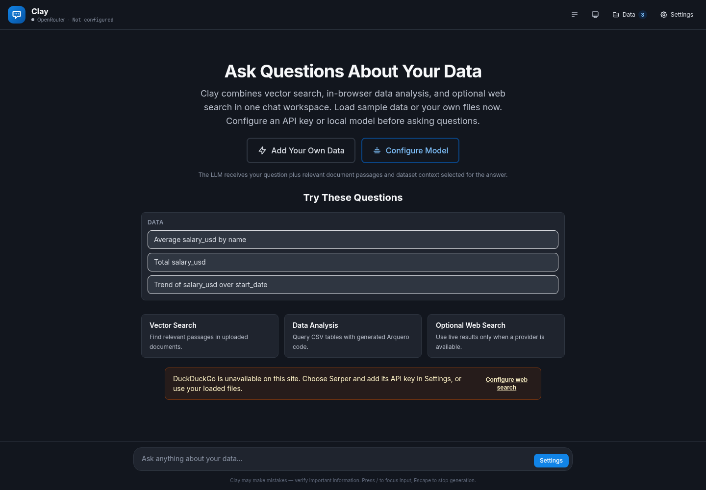
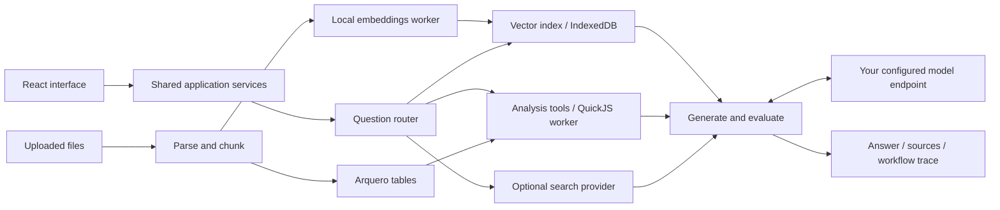

# Clay

**Ask questions about your files, then inspect the sources and analysis behind the answer.**

[Live demo](https://3bdrahman.github.io/clay/) · [Architecture](#architecture) · [Run locally](#run-locally)

[](https://github.com/3bdrahman/clay/actions/workflows/ci.yml)
[](https://github.com/3bdrahman/clay/actions/workflows/deploy-github-pages.yml)
[](LICENSE)

Clay is a browser application for document retrieval and structured data analysis. It routes questions to uploaded documents, CSV analysis, or an optional web-search provider, then shows the answer alongside citations and an inspectable execution trace.

React, TypeScript, and Vite power the interface. Local embeddings, IndexedDB, and a worker-isolated analysis engine let the frontend run on a static host. Answer generation uses OpenRouter or a local OpenAI-compatible server.



## Try the demo

1. Open [Clay](https://3bdrahman.github.io/clay/). Load the sample data or open **Data** to add your own files. Loading files requires no model API key.
2. Open **Settings**, choose **OpenRouter**, and add your key. Clay recommends an available approved free model. Alternatively, connect a running **Local server** and select one of its installed models.
3. With the sample data loaded, ask **“How many employees are in each department?”** Choose a model that supports tools to inspect the data through the analysis tools.
4. Expand **Show workflow** to inspect routing, tool calls, retries, and timing. The sources panel shows retrieved passages or analysis results; citation excerpts remain available after a reload.

The demo has no shared API key and does not serve prerecorded answers. OpenRouter requests are restricted to approved free variants with zero-price routing limits. You can explore the interface and load data before connecting a model.

| Input | What Clay does |
| --- | --- |
| CSV | Parses a table, infers column types, and makes it available for filtering, aggregation, joins, statistics, and charts. |
| PDF, Markdown, text, JSON | Extracts text, chunks it, embeds it locally, and retrieves relevant passages. JSON is treated as document text. |
| Web search | Uses Serper with your key, or DuckDuckGo through a configured proxy. The hosted demo needs a Serper key for web search. |

PDFs need extractable text; OCR is not included. The embedding model downloads on the first document upload, so the first import needs network access and takes longer. File size and analysis capacity depend on the browser and device.

## Supported models

OpenRouter exposes a small approved shortlist, not the full provider catalog or a manual model-ID field. Availability is checked against the live catalog; an unavailable choice is not replaced with an arbitrary model.

| Provider | Recommended | Second choice | Access |
| --- | --- | --- | --- |
| OpenRouter | Nemotron 3 Super 120B `:free` | Qwen3.8 27B `:free` | Exact free variants, live zero-price checks, and request-level price ceilings of zero. |
| Local | Your installed models | Your installed models | No cloud shortlist; the server's model catalog is used. |

These choices target tool use, code generation, and long-context analysis. The ordered OpenRouter IDs live in [`providerModels.config.json`](web/src/lib/providerModels.config.json). The first eligible model is recommended unless you explicitly select another approved option.

OpenRouter free variants have [rate limits](https://openrouter.ai/docs/api_reference/limits); [zero-price provider routing](https://openrouter.ai/docs/guides/routing/provider-selection) prevents paid fallback. Qwen's current catalog does not advertise `response_format`, so Clay uses prompted JSON with parsing/validation for that model instead of sending an unsupported parameter.

## Architecture


```mermaid
flowchart LR
    UI[React interface] --> Shared[Shared application services]
    Files[Uploaded files] --> Ingest[Parse and chunk]
    Ingest --> Tables[Arquero tables]
    Ingest --> Embeddings[Local embeddings worker]
    Embeddings --> Index[Vector index / IndexedDB]
    Shared --> Router[Question router]
    Router --> Index
    Router --> Tools[Analysis tools / QuickJS worker]
    Tables --> Tools
    Router --> Search[Optional search provider]
    Index --> Answer[Generate and evaluate]
    Tools --> Answer
    Search --> Answer
    Answer <--> Model[Your configured model endpoint]
    Answer --> View[Answer / sources / workflow trace]
```

| Responsibility | Implementation |
| --- | --- |
| Application lifecycle | [`useClay`](web/src/hooks/useClay.ts) owns a shared service bundle for uploads and chat; [`clayServices`](web/src/services/clayServices.ts) assembles clients and disposes their workers. |
| Routing and recovery | [`orchestrator`](web/src/services/orchestrator.ts) routes against the loaded data, retrieves context, generates an answer, and evaluates it with bounded retries. Successful context survives a retry through another source. |
| Document retrieval | [`vectorstore`](web/src/lib/vectorstore.ts) persists chunks in IndexedDB. Embeddings use the fixed local `all-MiniLM-L6-v2` model; similarity search uses exact cosine search for smaller indexes and HNSW for larger ones. |
| Data analysis | [`analyzer`](web/src/services/analyzer.ts) exposes dataset inspection, statistics, aggregation, sampling, correlation, and code execution. Models without tool support use an explicit single-request analysis path. |
| Generated-code isolation | [`realmExecutor`](web/src/services/realmExecutor.ts) creates a fresh QuickJS context inside a dedicated worker, with time and memory limits and no browser storage or network APIs. |
| UI and persistence | [`components`](web/src/components) render conversations, sources, charts, and workflow steps. [`store`](web/src/store.ts) persists settings and compact conversation history. |

One selected chat model handles routing, analysis, generation, and evaluation. This makes model choice explicit, but a question can still require several provider calls. Evaluation and retries improve recovery; they do not guarantee a correct answer.

## Data and privacy

- Files are parsed in the browser. CSV data, document chunks, and vectors are stored in IndexedDB; settings, API keys, and conversation history use localStorage.
- **Your model receives more than the question.** Requests can include retrieved document passages, dataset names and schemas, sampled rows, analysis results, and previous analysis context. Use data appropriate for the provider you select.
- Embedding inference runs locally. Model files download from Hugging Face on first use and are cached by the browser.
- Search queries go to the selected search provider or configured proxy. A provider failure is surfaced rather than silently sending the query to another provider.
- Browser storage is not an encrypted credential vault. Clear keys in Settings on a shared device. **Reset everything** removes the application's settings, conversations, and loaded data; browser-managed model caches are separate.

## Run locally

Use **Node.js 22** and npm, matching CI.

```bash
git clone https://github.com/3bdrahman/clay.git
cd clay/web
npm ci
npm run dev
```

Open the URL printed by Vite, normally `http://localhost:5173`. Provider keys are entered in the app; do not put secrets in `VITE_*` variables, which are exposed to the client bundle.

For a local model, enter the server's OpenAI-compatible `/v1` URL in Settings, click **Discover**, and select a model. The server must allow requests from Clay's origin. A locally served Clay instance is the most straightforward option when browser restrictions prevent the hosted HTTPS demo from reaching an HTTP model server.

## Verify and build

Run these commands from `web/`:

```bash
npm run verify       # type checking, lint, tests, production build
npm run test:watch   # focused development loop
npm run eval         # evaluation-metric and question-set tests (no live model calls)
npm run preview      # serve the production build locally
```

The tests cover routing and retries, tool execution, sandbox isolation, retrieval and persistence, provider errors, and UI state transitions. Provider responses are mocked in unit tests; those tests do not establish live model accuracy. The evaluation tests check scoring functions and deterministic question-set consistency, not the factual quality of a deployed model.

For a release, also exercise the built app: import a document and query it without reloading; run a sample-data analysis; cancel a response; reload and inspect saved citations; check setup and error states at desktop and mobile widths. Live answers depend on a reachable configured model and must be checked separately from the automated suite.

## Deployment

The application builds to `web/dist`. [GitHub Pages deployment](.github/workflows/deploy-github-pages.yml) runs the complete verification command before uploading the site. [CI](.github/workflows/ci.yml) also validates pull requests using the committed lockfile.

Set build-time variables in the shell or deployment environment:

| Variable | Purpose |
| --- | --- |
| `DEPLOY_TARGET=github-pages` | Uses `/<repository>/` as the asset base path. |
| `BASE_PATH` | Overrides the base for other static hosts; defaults to `./`. |
| `VITE_DEPLOY_URL` | Canonical deployment URL for social previews and the CSP origin. |
| `VITE_WEBSEARCH_BASE_URL` | DuckDuckGo proxy URL. Without a proxy, use Serper for hosted web search. |
| `VITE_CSP_EXTRA_CONNECT_SRC` | Comma-separated additional origins allowed for connections, such as a search proxy or remote model server. |
| `VITE_OPENROUTER_REFERER` | Optional application URL sent to OpenRouter. |

The CSP permits WebAssembly and Arquero's code generation. Generated analysis code runs in its separate QuickJS worker; static hosting alone does not make untrusted inputs safe in every other application boundary.

## Keyboard shortcuts

| Shortcut | Action |
| --- | --- |
| `/` | Focus the question field |
| `Enter` / `Shift+Enter` | Send / insert a line break |
| `Esc` | Stop generation |
| `Cmd/Ctrl+K` | New conversation |
| `Cmd/Ctrl+Shift+C` | Clear the current conversation, with confirmation |

## License

[MIT](LICENSE)
